

# Offway

### 남은 연차로 다녀올 수 있는 인구감소지역 여행을 추천하는 로컬 여행 플래너

남은 연차에 맞춰 다녀올 수 있는 지역과 코스를 추천하고,
교통·숙박 혜택까지 연결합니다.

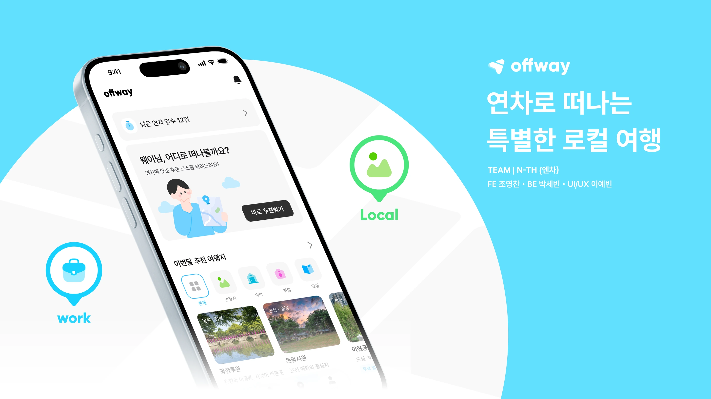

🌐 [offway.cloud](https://offway.cloud) · [이용약관](https://offway.cloud/terms) · [개인정보처리방침](https://offway.cloud/privacy) · [고객지원](https://offway.cloud/support)

---

## 프로젝트 개요

| 구분 | 내용 |
|---|---|
| 프로젝트명 | Offway (오프웨이) |
| 프로젝트 형태 | 연차 기반 로컬 여행 코스 추천 iOS 앱 |
| 참가 분야 | 2026 관광데이터 활용 공모전 |
| 주요 사용자 | 남은 연차로 짧은 국내 여행을 계획하는 직장인 |
| 핵심 목표 | 남은 연차로 실제로 다녀올 수 있는 인구감소지역 여행을 추천해, 지역 방문과 혜택 이용으로 이어지게 한다 |
| 활용 데이터 | 한국관광공사 TourAPI · 행정안전부 인구감소지역 · 국토교통부 TAGO · 기상청 등 공공데이터 |
| 서비스 현황 | App Store 출시 (iOS) |

---

## 프로젝트 배경

국내 여행 수요가 주요 도시로 쏠리는 동안, 행정안전부가 지정한 **89개 인구감소지역**은 생활인구 유입이 절실합니다. 좋은 관광 자원이 있어도 잘 알려지지 않아 여행지 후보에 잘 오르지 않습니다.

정부와 지자체가 숙박세일페스타, 디지털관광주민증, KTX·SRT 할인 같은 지원책을 마련했지만, 정보가 부처와 지자체마다 흩어져 있어 여행자에게 잘 닿지 않습니다.

한편 여행자는 연차가 남아 있어도 '며칠로 어디까지 다녀올 수 있는지'부터 따져야 해서, 익숙한 곳을 다시 고르기 쉽습니다.

Offway 는 **남은 연차**를 출발점으로 삼아 89개 지역 중 실제로 다녀올 수 있는 곳의 코스를 완성하고, 그 여정에서 받을 수 있는 혜택을 함께 연결합니다.

---

## 서비스 소개

**여행지를 고르는 기준을 바꿨습니다.**

대부분의 여행 서비스가 '어디로 갈지'를 먼저 정한다면, Offway 는 '이번 여행에 연차를 얼마나 쓸 수 있는지'부터 봅니다. 남은 연차와 출발지, 이동수단, 여행 스타일에 맞춰 실제로 다녀올 수 있는 지역과 코스를 추천합니다.

**여행 전후의 연차까지 함께 관리합니다.**

남은 연차를 기록하고 황금연휴처럼 연차를 쓰기 좋은 시기를 알려줍니다. 여행을 다녀오면 사용한 연차를 반영해 다음 여행 계획에 다시 씁니다.

**89개 인구감소지역을 중심으로 소개합니다.**

익숙한 인기 관광지보다 인구감소지역 89곳을 중심으로 새로운 여행지를 제안합니다. 모든 코스는 **최대 2박 3일**입니다 — 콘텐츠가 얇은 지역에서 그보다 길어지면 코스가 빈약해지기 때문입니다.

**받을 수 있는 혜택을 코스 옆에 붙여 둡니다.**

부처와 지자체마다 흩어진 여행 혜택을 운영진이 검증해 모으고, 코스의 지역에 해당하는 것만 골라 보여줍니다. 카드를 누르면 신청 페이지로 바로 넘어갑니다.

---

## 서비스 이용 흐름

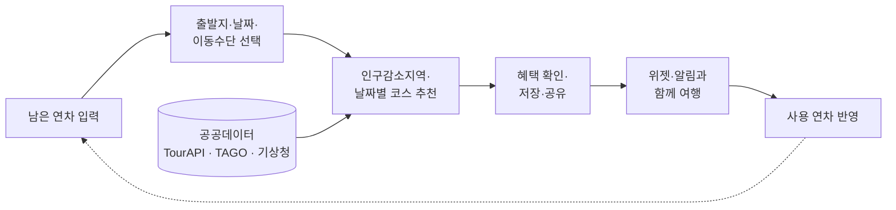
```mermaid
flowchart LR
    Leave[남은 연차 입력] --> Pick[출발지·날짜·<br/>이동수단 선택]
    Pick --> Course[인구감소지역·<br/>날짜별 코스 추천]
    Data[(공공데이터<br/>TourAPI · TAGO · 기상청)] --> Course
    Course --> Save[혜택 확인·<br/>저장·공유]
    Save --> Trip[위젯·알림과<br/>함께 여행]
    Trip --> Record[사용 연차 반영]
    Record -.-> Leave
```

---

## 주요 화면

**1 · 연차 기반 맞춤 여행 코스 추천**

| 연차 입력 | 홈 | 기간 스타일 | 이동수단 |
|:---:|:---:|:---:|:---:|
| 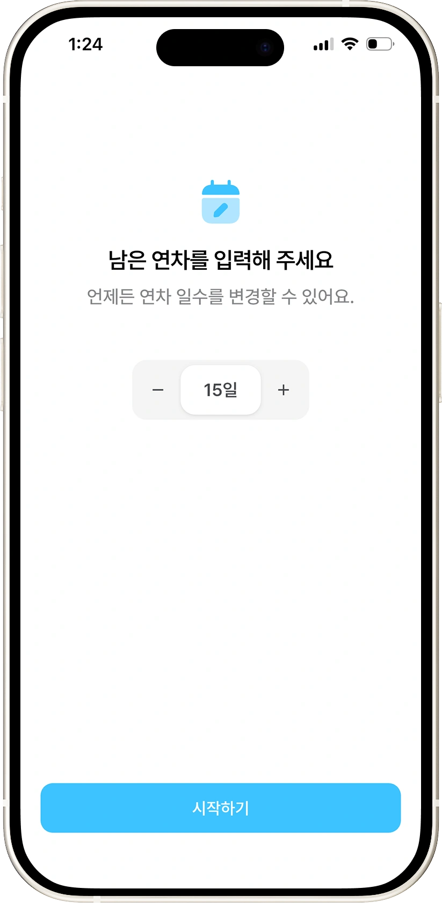 | 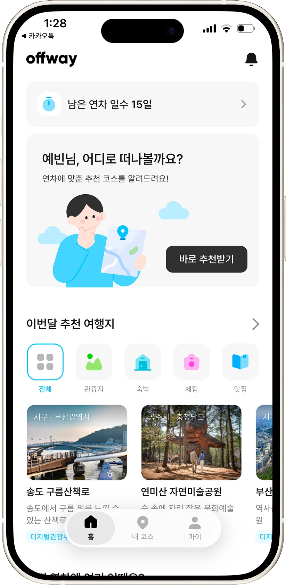 | 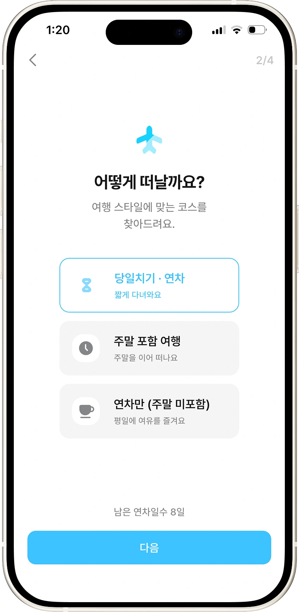 | 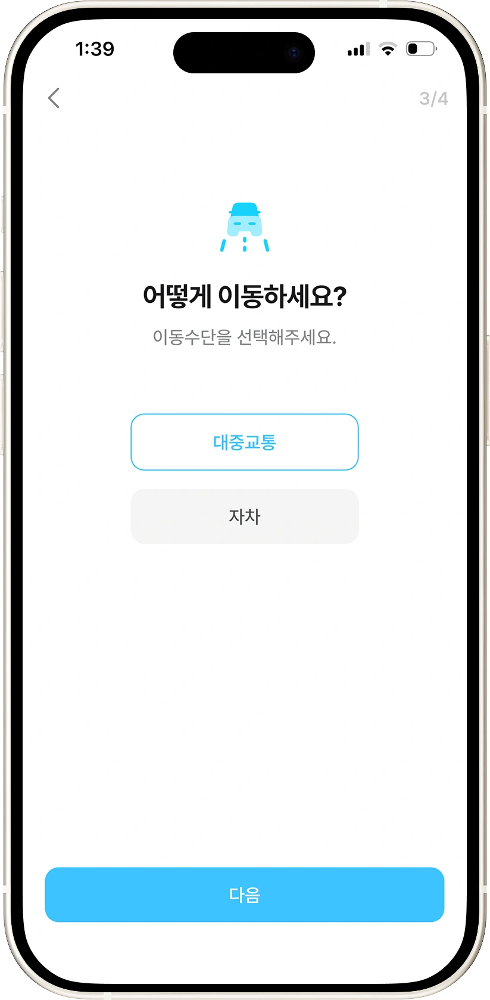 |

**2 · 조건에 맞는 지역·코스 추천**

| 추천 계산 | 후보 지역 | 코스 추천 | 혜택 확인·저장 |
|:---:|:---:|:---:|:---:|
|  | 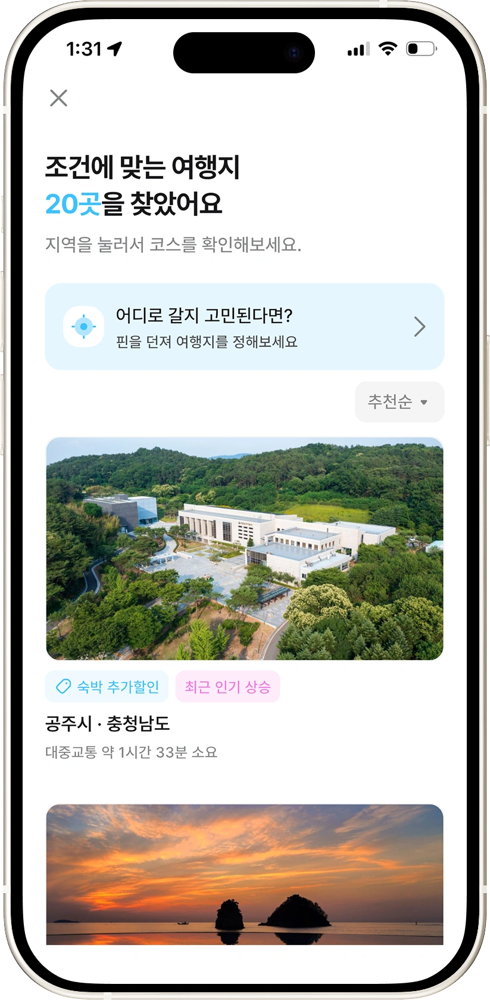 | 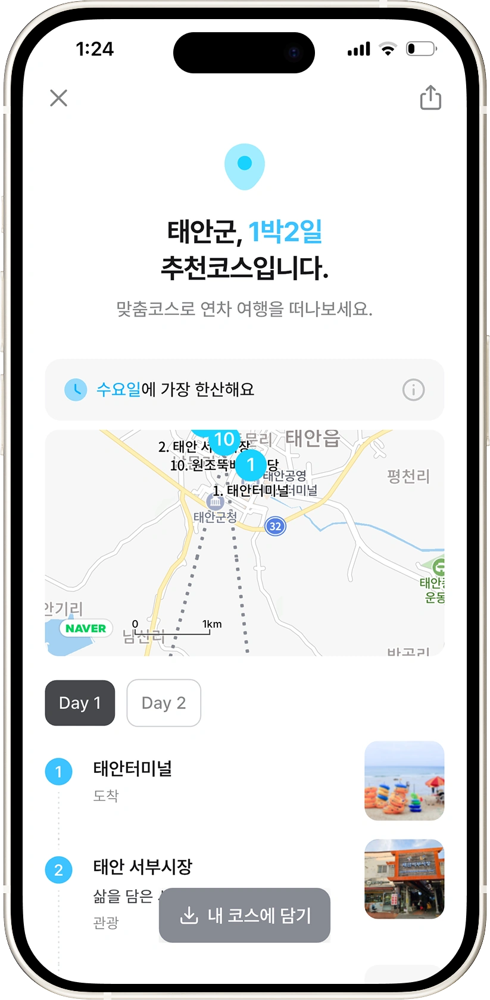 | 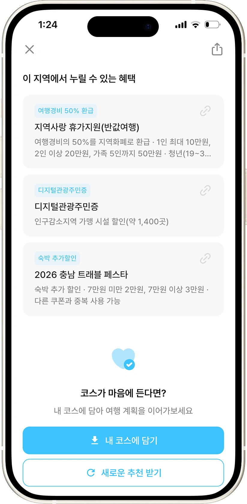 |

**3 · 저장한 여행 관리·상세 정보**

| 내 코스 | 코스 상세 | 운영 정보 | 장소 상세 |
|:---:|:---:|:---:|:---:|
| 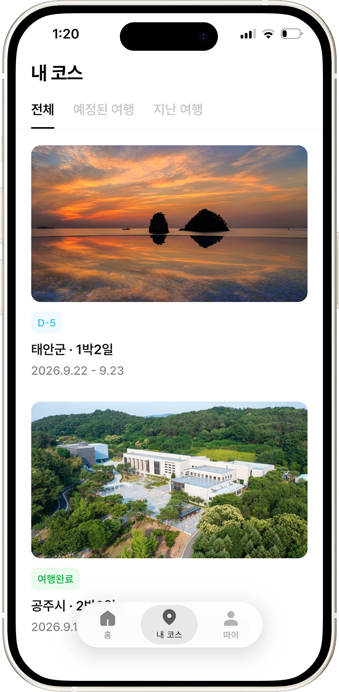 | 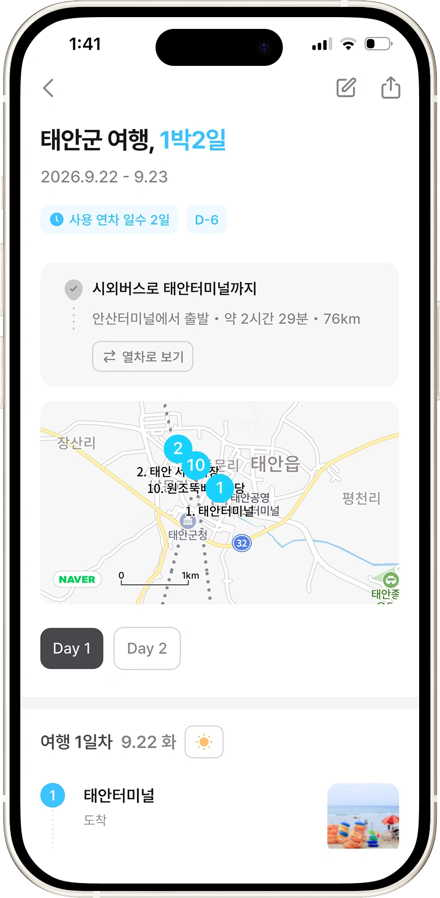 | 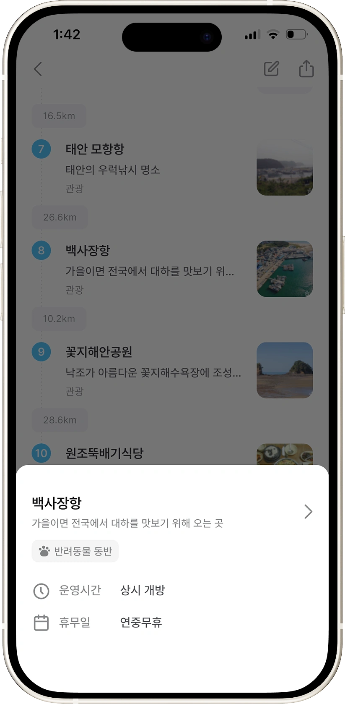 | 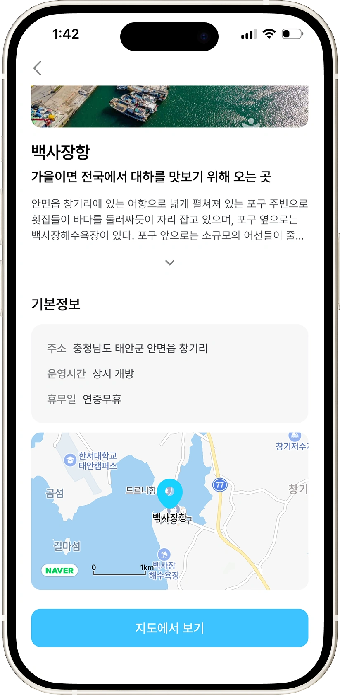 |

**4 · 연차 사용 기록 및 관리**

| 여행 후 확인 | 내 연차 | 연차 사용 등록 | 연차 반영 |
|:---:|:---:|:---:|:---:|
| 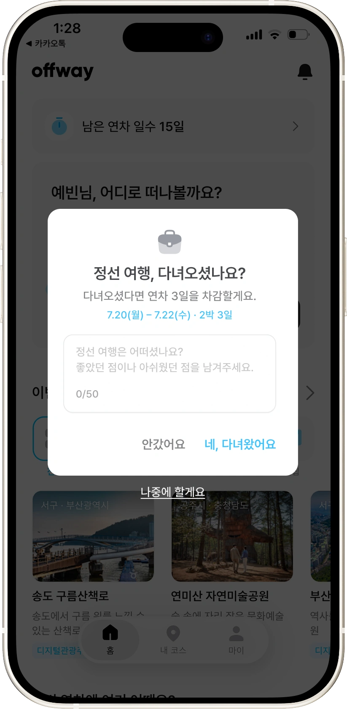 | 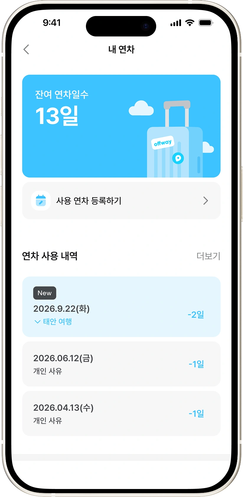 | 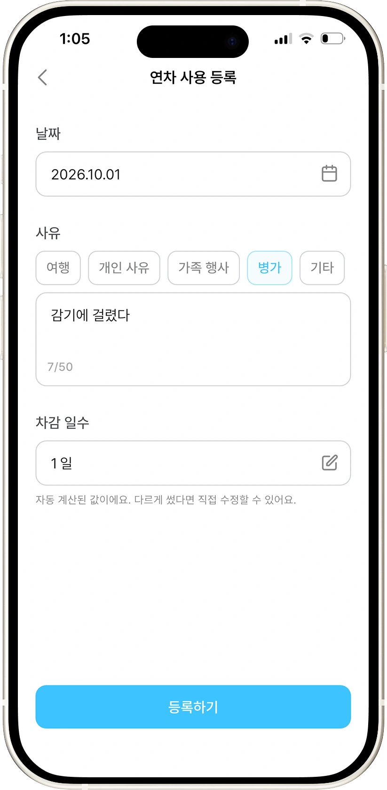 | 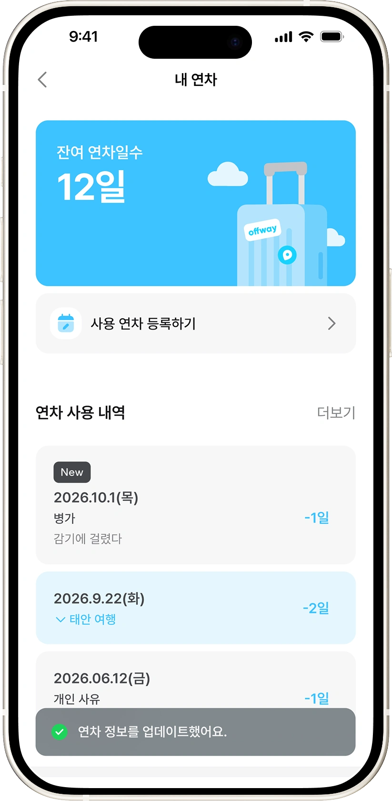 |

**5 · 여행 정보 탐색 및 일정 알림**

| 여행 혜택 | 지역 상세 | 관광지·혜택 | 위젯·다이나믹 아일랜드 |
|:---:|:---:|:---:|:---:|
| 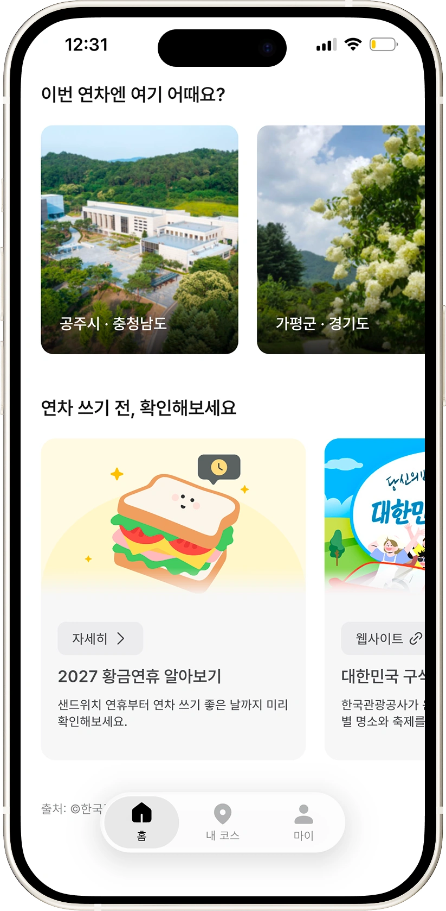 | 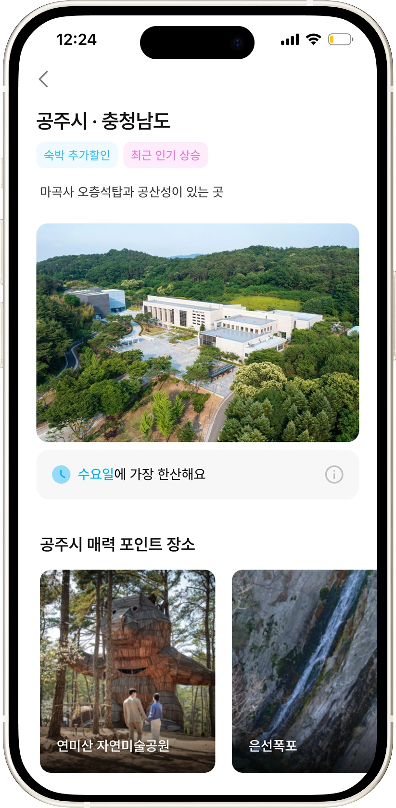 | 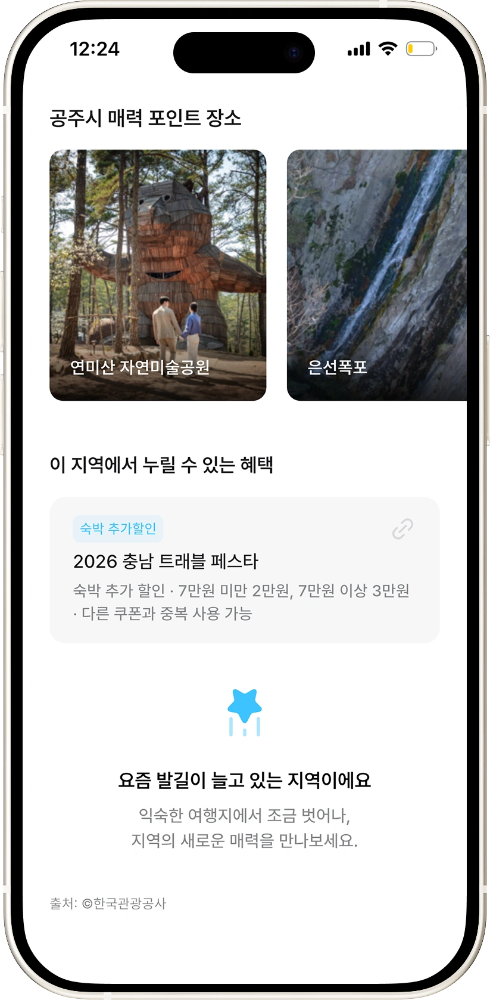 | 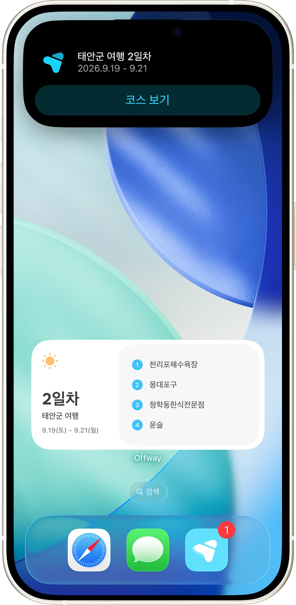 |

---

## 레포지토리

| 레포 | 무엇을 하나 | 스택 |
|---|---|---|
| [**offway-client**](https://github.com/team-offway/offway-client) | iOS 앱 · 홈 화면/잠금화면 위젯 · 다이나믹 아일랜드 · 공유 웹([offway.cloud](https://offway.cloud)) | Flutter · Swift · Vercel |
| [**core**](https://github.com/team-offway/core) | API 서버 · 지역 추천 · 코스 생성 · 연차 · 알림 · 백오피스 | Java · Spring Boot · MySQL · AWS |

---

## 데이터와 출처

인구감소지역 **89곳 전부**에 대해 맛집·숙소·카페·관광명소·국가유산·야영장·축제 **126,873곳**을 미리 확보해 두었습니다.

<table>
  <thead>
    <tr>
      <th width="110">분야</th>
      <th>활용한 데이터 · API</th>
    </tr>
  </thead>
  <tbody>
    <tr>
      <td>관광 정보</td>
      <td>한국관광공사 국문 관광정보 · 연관 관광지 · 기초지자체 중심 관광지 · 관광사진 · 고캠핑 · 무장애 여행 · 반려동물 동반여행 · 관광지 집중률 예측 · 빅데이터 지역별 방문자수</td>
    </tr>
    <tr>
      <td>장소</td>
      <td>지방행정 인허가 데이터(음식점·카페·숙박업) · 국가유산청 국가유산 검색 · 전국문화축제표준데이터</td>
    </tr>
    <tr>
      <td>이동</td>
      <td>국토교통부 TAGO 열차·고속버스·시외버스·국내선박 · SK TMAP 경로·경유지 최적화</td>
    </tr>
    <tr>
      <td>날씨 · 날짜</td>
      <td>기상청 단기·중기예보 · 한국천문연구원 특일정보(공휴일)</td>
    </tr>
    <tr>
      <td>지역</td>
      <td>행정안전부 인구감소지역 지정(89곳)</td>
    </tr>
    <tr>
      <td>혜택</td>
      <td>정부·지자체 여행 지원 정책 — 운영진이 검증한 것만 노출</td>
    </tr>
  </tbody>
</table>

전체 목록과 건수는 core 의 [데이터 풀](https://github.com/team-offway/core#데이터-풀)에 있습니다.

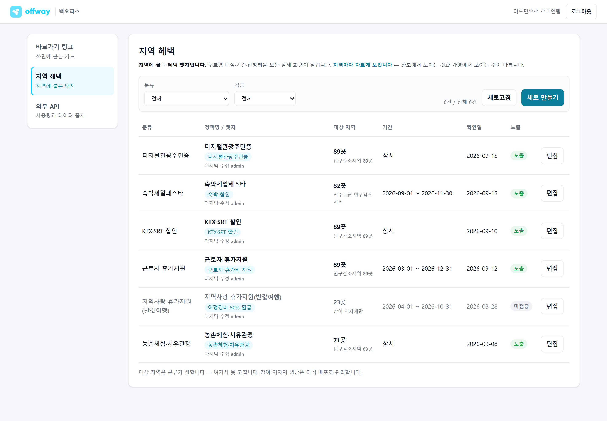

백오피스에서 혜택마다 대상 지역·기간·확인일을 관리하고, 검증한 것만 앱에 노출합니다.

---

## 서비스 발전 계획

**여행자의 실제 경험을 지역에 전달합니다.**

여행이 끝난 뒤 좋았던 점과 아쉬웠던 점을 간단히 남길 수 있도록 합니다. 이런 기록이 쌓이면 방문자 수만으로는 알기 어려웠던, 여행자가 왜 방문했고 무엇에 만족했는지 확인할 수 있습니다.

**쌓인 피드백을 지역의 다음 관광 정책에 활용합니다.**

여행자 피드백을 지자체와 공유해 필요한 혜택을 보완하고, 축제·체험 프로그램 등 지역의 관광 일정에 맞춰 여행객을 연결하는 데 활용하고자 합니다.

**전국으로 확장합니다.**

Offway 에서 완성한 코스 추천 엔진과 대중교통 연계 기술을 전국 시·군·구로 확장해, '나의 연차와 이동수단'에 맞춰 전국 어디든 떠날 수 있는 종합 여행 플랫폼으로 도약하고자 합니다.

---

## 팀 소개

<table>
  <thead>
    <tr>
      <th align="center" width="33%">Client</th>
      <th align="center" width="33%">Backend</th>
      <th align="center" width="33%">Design</th>
    </tr>
  </thead>
  <tbody>
    <tr>
      <td align="center"></td>
      <td align="center"></td>
      <td align="center"></td>
    </tr>
    <tr>
      <td align="center"><b>조영찬</b></td>
      <td align="center"><b>박세빈</b></td>
      <td align="center"><b>이예빈</b></td>
    </tr>
    <tr>
      <td align="center"><a href="https://github.com/ychany">@ychany</a></td>
      <td align="center"><a href="https://github.com/sevineleven">@sevineleven</a></td>
      <td align="center"><a href="https://www.behance.net/bad7ac99">Behance</a></td>
    </tr>
  </tbody>
</table>
